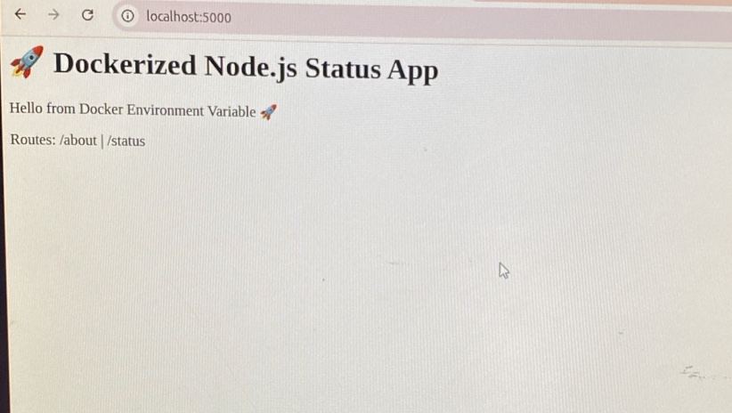
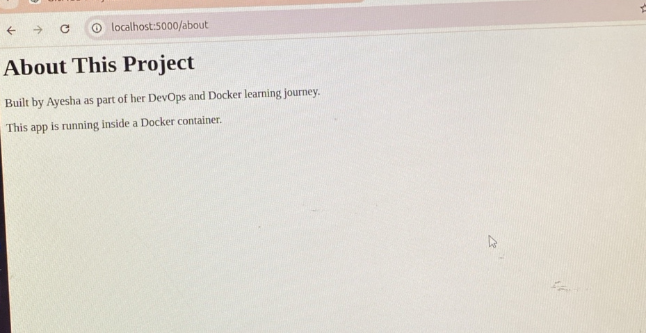
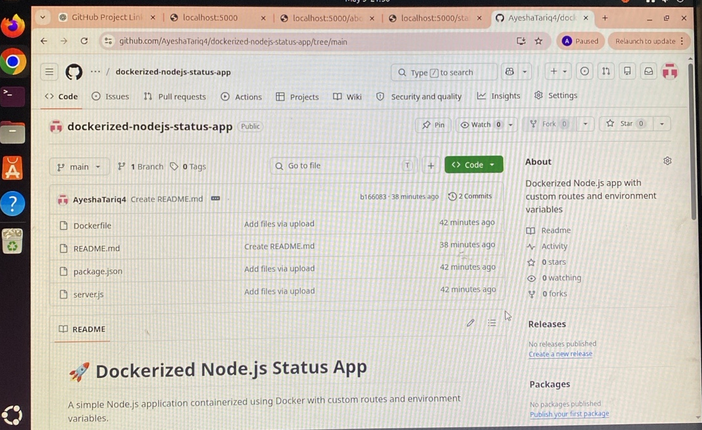

# 🚀 Dockerized Node.js Status App

A simple Node.js application containerized using Docker with custom routes and environment variables.

## 📌 Features
- Multiple routes (/ , /about , /status)
- JSON API response
- Environment variables
- Running inside Docker container

## ⚙️ Tech Stack
- Node.js
- Express.js
- Docker
- Linux

## 📊 Learning Outcome
- Dockerfile creation
- Containerization
- Port mapping
- Working with environment variables
## 📸 Project Preview

### Home Page

### About Page

### Status API

